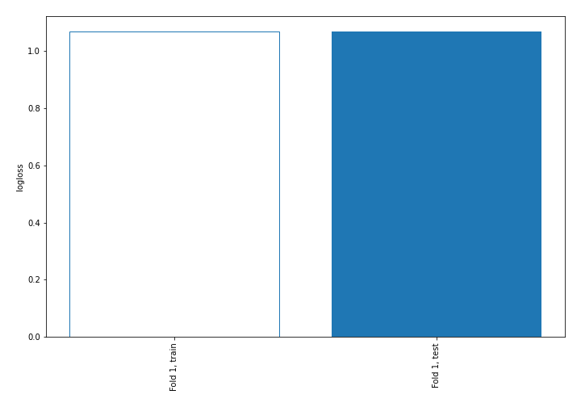
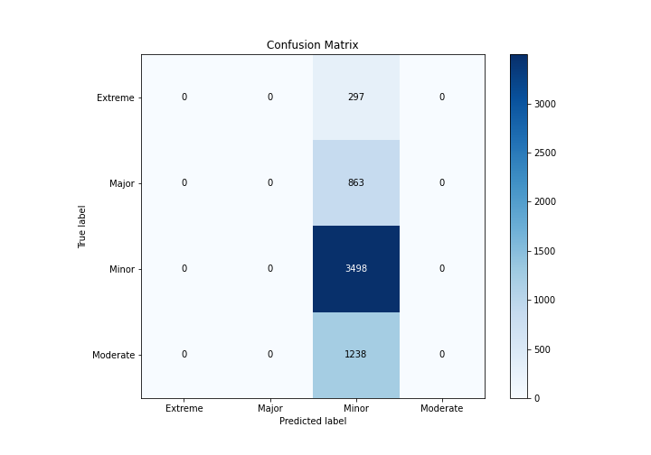
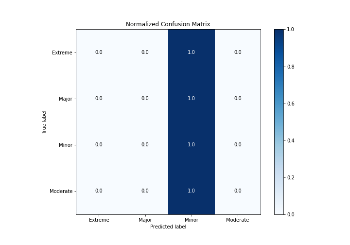
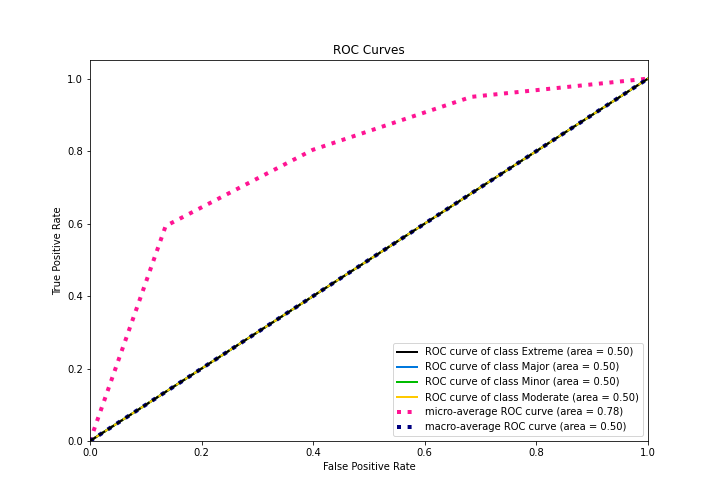
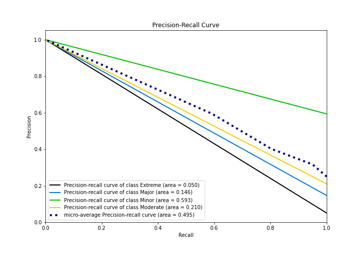

# Summary of 1_Baseline

[<< Go back](../README.md)

## Baseline Classifier (Baseline)
- **n_jobs**: -1
- **num_class**: 4
- **explain_level**: 2

## Validation
 - **validation_type**: split
 - **train_ratio**: 0.75
 - **shuffle**: True
 - **stratify**: True

## Optimized metric
logloss

## Training time

1.4 seconds

### Metric details
|           |   Extreme |   Major |       Minor |   Moderate |   accuracy |   macro avg |   weighted avg |   logloss |
|:----------|----------:|--------:|------------:|-----------:|-----------:|------------:|---------------:|----------:|
| precision |         0 |       0 |    0.593284 |          0 |   0.593284 |    0.148321 |       0.351985 |   1.06926 |
| recall    |         0 |       0 |    1        |          0 |   0.593284 |    0.25     |       0.593284 |   1.06926 |
| f1-score  |         0 |       0 |    0.744731 |          0 |   0.593284 |    0.186183 |       0.441836 |   1.06926 |
| support   |       297 |     863 | 3498        |       1238 |   0.593284 | 5896        |    5896        |   1.06926 |

## Confusion matrix
|                     |   Predicted as Extreme |   Predicted as Major |   Predicted as Minor |   Predicted as Moderate |
|:--------------------|-----------------------:|---------------------:|---------------------:|------------------------:|
| Labeled as Extreme  |                      0 |                    0 |                  297 |                       0 |
| Labeled as Major    |                      0 |                    0 |                  863 |                       0 |
| Labeled as Minor    |                      0 |                    0 |                 3498 |                       0 |
| Labeled as Moderate |                      0 |                    0 |                 1238 |                       0 |

## Learning curves

## Confusion Matrix

## Normalized Confusion Matrix

## ROC Curve

## Precision Recall Curve

[<< Go back](../README.md)
