# Summary of 2_DecisionTree

[<< Go back](../README.md)

## Decision Tree
- **n_jobs**: -1
- **criterion**: gini
- **max_depth**: 3
- **num_class**: 4
- **explain_level**: 2

## Validation
 - **validation_type**: split
 - **train_ratio**: 0.75
 - **shuffle**: True
 - **stratify**: True

## Optimized metric
logloss

## Training time

24.1 seconds

### Metric details
|           |    Extreme |      Major |       Minor |    Moderate |   accuracy |   macro avg |   weighted avg |   logloss |
|:----------|-----------:|-----------:|------------:|------------:|-----------:|------------:|---------------:|----------:|
| precision |   0.625337 |   0.554326 |    0.846174 |    0.606154 |   0.756615 |    0.657998 |       0.741934 |   0.59297 |
| recall    |   0.781145 |   0.63847  |    0.938822 |    0.318255 |   0.756615 |    0.669173 |       0.756615 |   0.59297 |
| f1-score  |   0.694611 |   0.59343  |    0.890094 |    0.417373 |   0.756615 |    0.648877 |       0.737565 |   0.59297 |
| support   | 297        | 863        | 3498        | 1238        |   0.756615 | 5896        |    5896        |   0.59297 |

## Confusion matrix
|                     |   Predicted as Extreme |   Predicted as Major |   Predicted as Minor |   Predicted as Moderate |
|:--------------------|-----------------------:|---------------------:|---------------------:|------------------------:|
| Labeled as Extreme  |                    232 |                   61 |                    4 |                       0 |
| Labeled as Major    |                    116 |                  551 |                   86 |                     110 |
| Labeled as Minor    |                      5 |                   63 |                 3284 |                     146 |
| Labeled as Moderate |                     18 |                  319 |                  507 |                     394 |

## Learning curves
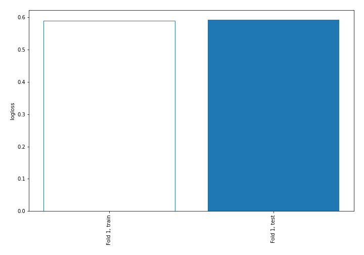

## Decision Tree 

### Tree #1
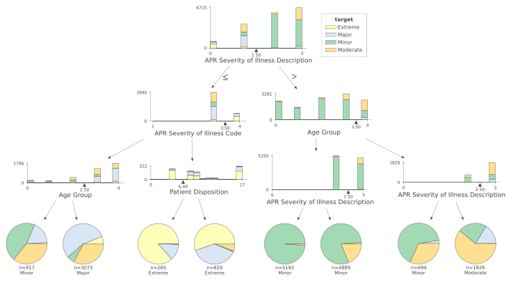

### Rules

if (APR Severity of Illness Description > 1.5) and (Age Group <= 3.5) and (APR Severity of Illness Description <= 2.5) then class: Minor (proba: 98.38%) | based on 5,192 samples

if (APR Severity of Illness Description > 1.5) and (Age Group <= 3.5) and (APR Severity of Illness Description > 2.5) then class: Minor (proba: 79.81%) | based on 4,889 samples

if (APR Severity of Illness Description <= 1.5) and (APR Severity of Illness Code <= 3.5) and (Age Group > 2.5) then class: Major (proba: 55.22%) | based on 3,073 samples

if (APR Severity of Illness Description > 1.5) and (Age Group > 3.5) and (APR Severity of Illness Description > 2.5) then class: Moderate (proba: 60.9%) | based on 1,826 samples

if (APR Severity of Illness Description <= 1.5) and (APR Severity of Illness Code <= 3.5) and (Age Group <= 2.5) then class: Minor (proba: 45.15%) | based on 917 samples

if (APR Severity of Illness Description <= 1.5) and (APR Severity of Illness Code > 3.5) and (Patient Disposition > 6.0) then class: Extreme (proba: 55.25%) | based on 829 samples

if (APR Severity of Illness Description > 1.5) and (Age Group > 3.5) and (APR Severity of Illness Description <= 2.5) then class: Minor (proba: 65.56%) | based on 694 samples

if (APR Severity of Illness Description <= 1.5) and (APR Severity of Illness Code > 3.5) and (Patient Disposition <= 6.0) then class: Extreme (proba: 86.42%) | based on 265 samples

## Permutation-based Importance
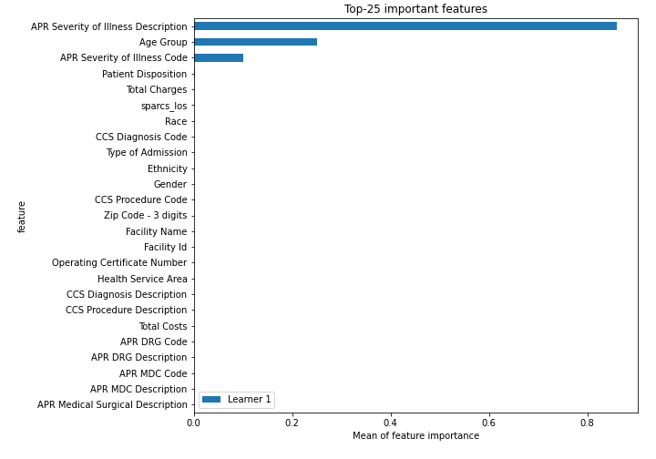
## Confusion Matrix

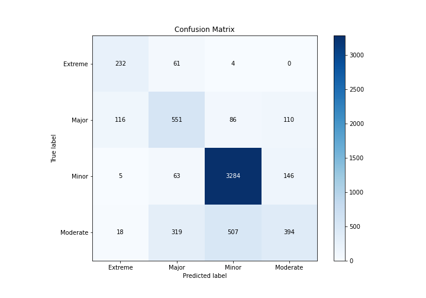

## Normalized Confusion Matrix

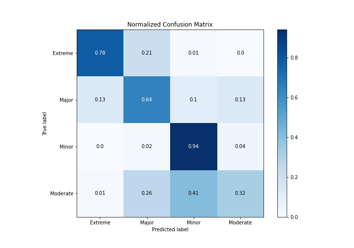

## ROC Curve

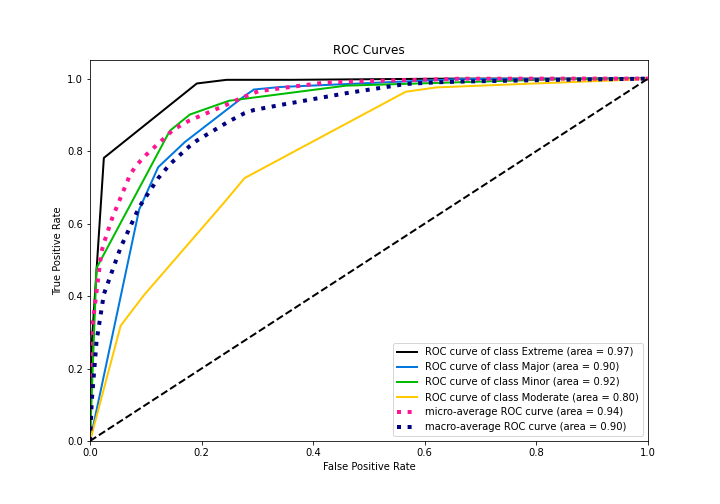

## Precision Recall Curve

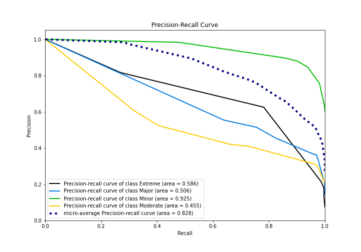

## SHAP Importance
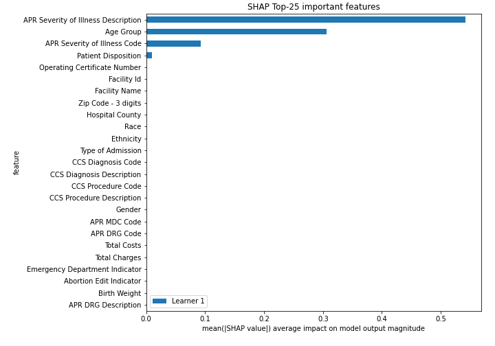

## SHAP Dependence plots

### Dependence Extreme (Fold 1)
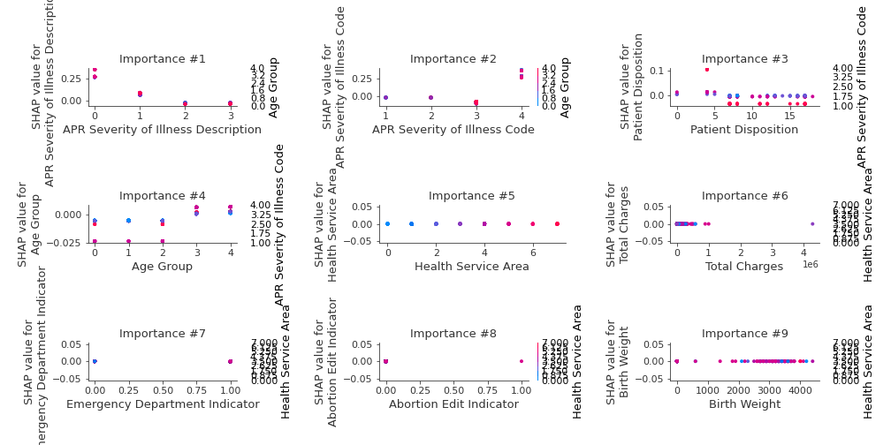
### Dependence Major (Fold 1)
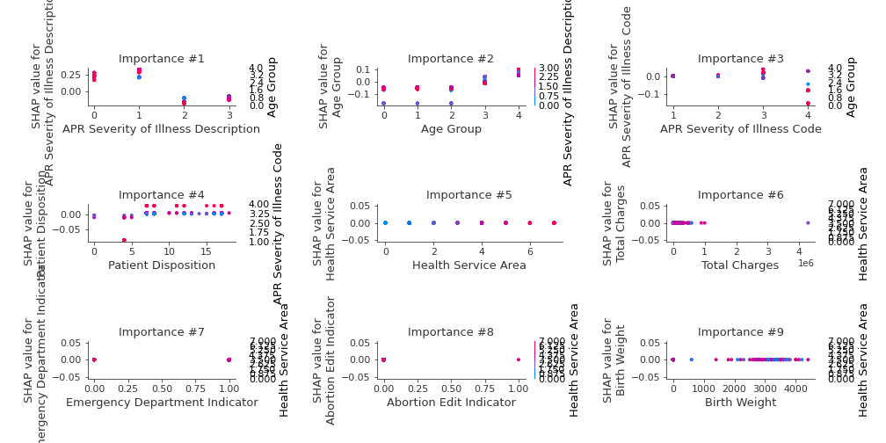
### Dependence Minor (Fold 1)
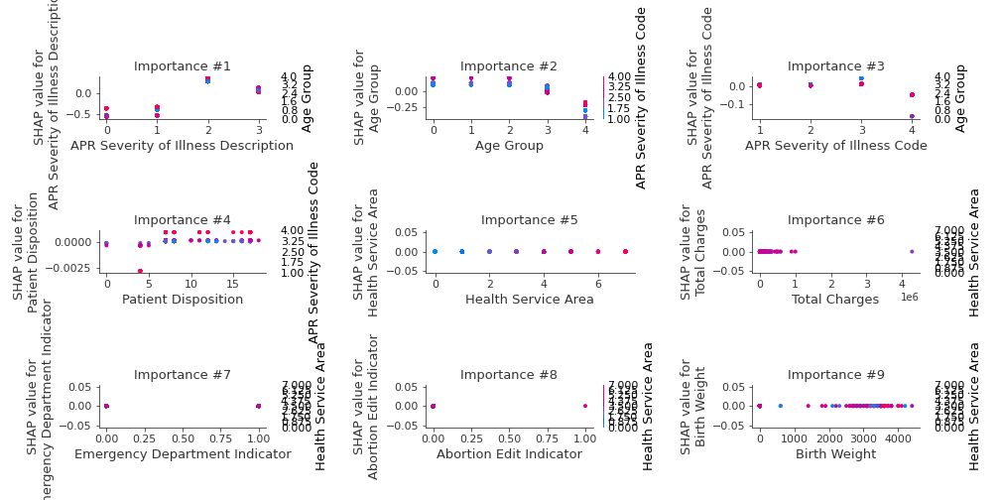
### Dependence Moderate (Fold 1)
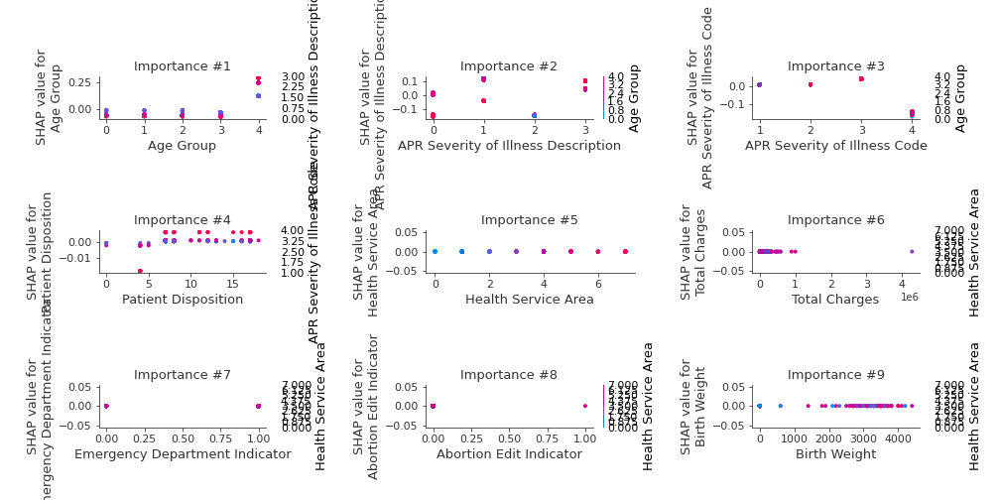

## SHAP Decision plots

### Worst decisions for selected sample 1 (Fold 1)
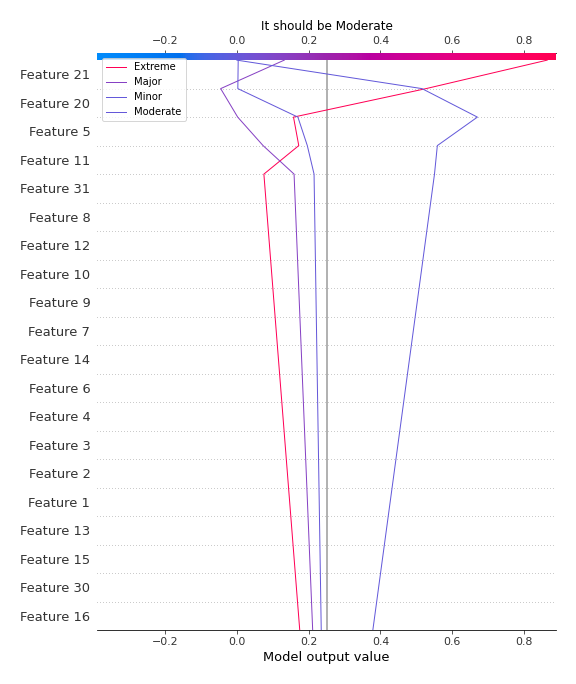
### Worst decisions for selected sample 2 (Fold 1)
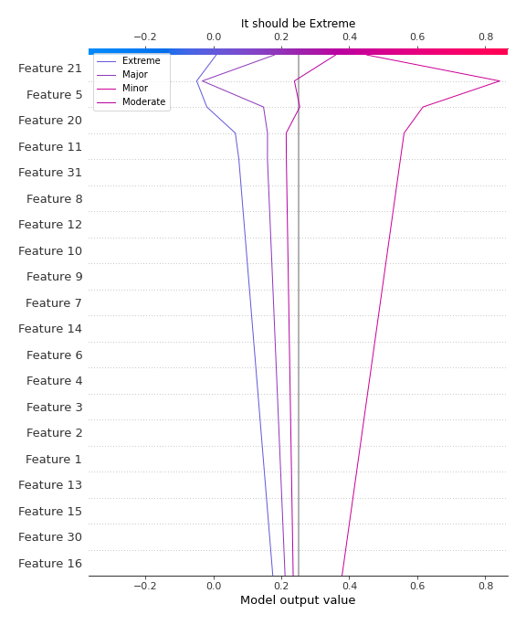
### Worst decisions for selected sample 3 (Fold 1)
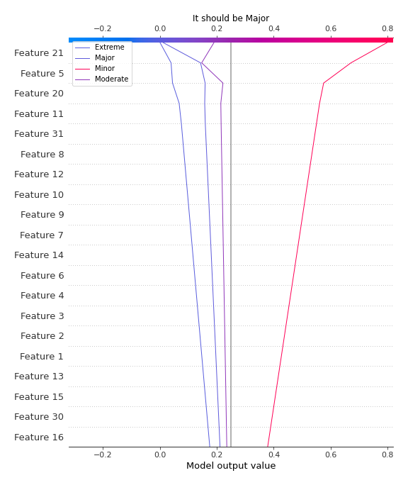
### Worst decisions for selected sample 4 (Fold 1)

### Best decisions for selected sample 1 (Fold 1)

### Best decisions for selected sample 2 (Fold 1)

### Best decisions for selected sample 3 (Fold 1)
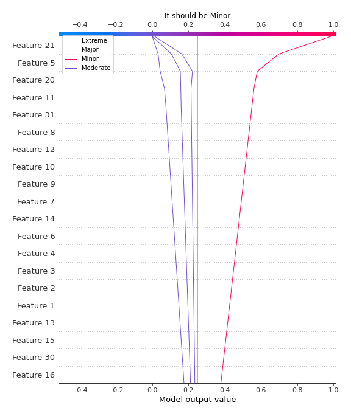
### Best decisions for selected sample 4 (Fold 1)

[<< Go back](../README.md)
