# Summary of 3_Default_Xgboost

[<< Go back](../README.md)

## Extreme Gradient Boosting (Xgboost)
- **n_jobs**: -1
- **objective**: multi:softprob
- **eta**: 0.075
- **max_depth**: 6
- **min_child_weight**: 1
- **subsample**: 1.0
- **colsample_bytree**: 1.0
- **eval_metric**: mlogloss
- **num_class**: 4
- **explain_level**: 2

## Validation
 - **validation_type**: split
 - **train_ratio**: 0.75
 - **shuffle**: True
 - **stratify**: True

## Optimized metric
logloss

## Training time

50.1 seconds

### Metric details
|           |    Extreme |      Major |       Minor |    Moderate |   accuracy |   macro avg |   weighted avg |   logloss |
|:----------|-----------:|-----------:|------------:|------------:|-----------:|------------:|---------------:|----------:|
| precision |   0.700704 |   0.611111 |    0.894384 |    0.574581 |    0.78036 |    0.695195 |       0.776015 |  0.503254 |
| recall    |   0.670034 |   0.637312 |    0.915094 |    0.525848 |    0.78036 |    0.687072 |       0.78036  |  0.503254 |
| f1-score  |   0.685026 |   0.623936 |    0.904621 |    0.549135 |    0.78036 |    0.69068  |       0.777833 |  0.503254 |
| support   | 297        | 863        | 3498        | 1238        |    0.78036 | 5896        |    5896        |  0.503254 |

## Confusion matrix
|                     |   Predicted as Extreme |   Predicted as Major |   Predicted as Minor |   Predicted as Moderate |
|:--------------------|-----------------------:|---------------------:|---------------------:|------------------------:|
| Labeled as Extreme  |                    199 |                   89 |                    3 |                       6 |
| Labeled as Major    |                     73 |                  550 |                   28 |                     212 |
| Labeled as Minor    |                      4 |                   29 |                 3201 |                     264 |
| Labeled as Moderate |                      8 |                  232 |                  347 |                     651 |

## Learning curves
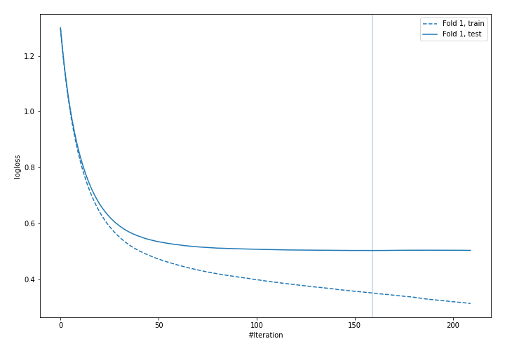

## Permutation-based Importance
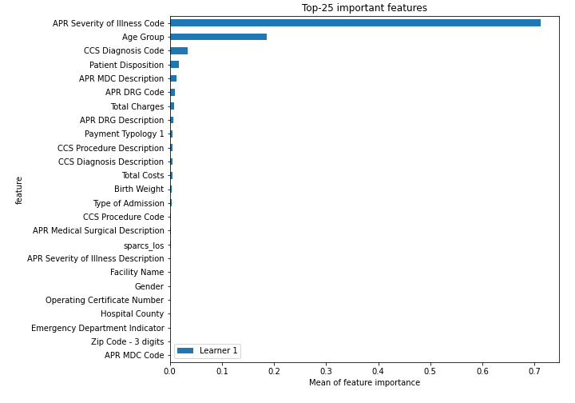
## Confusion Matrix

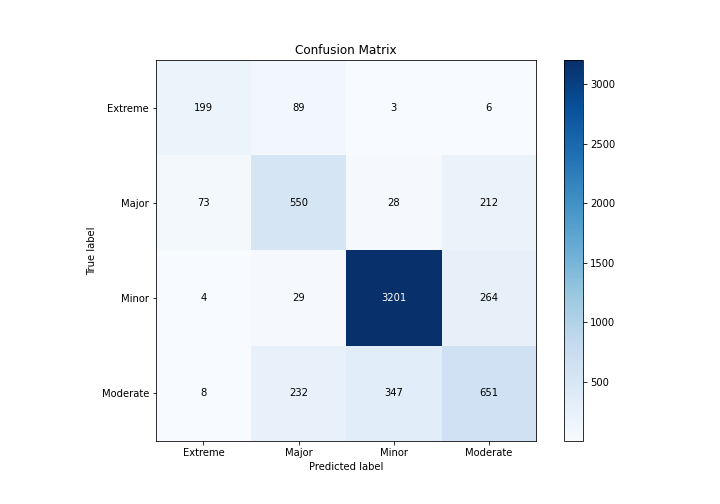

## Normalized Confusion Matrix

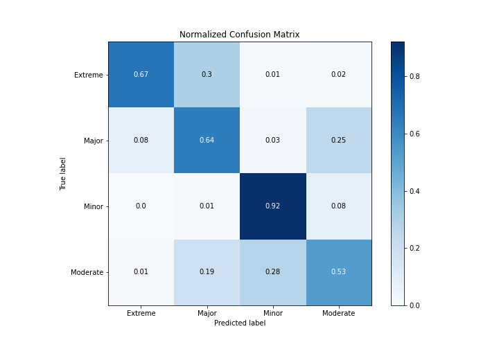

## ROC Curve

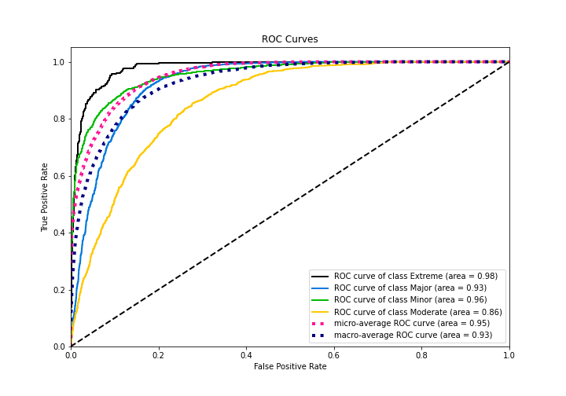

## Precision Recall Curve

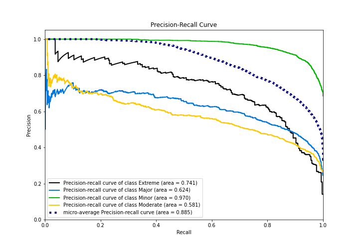

## SHAP Importance
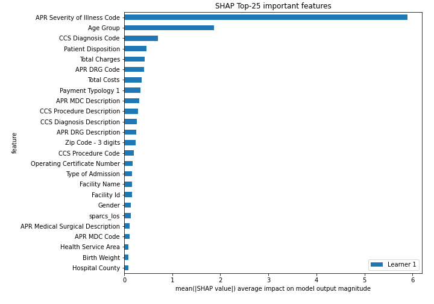

## SHAP Dependence plots

### Dependence Extreme (Fold 1)
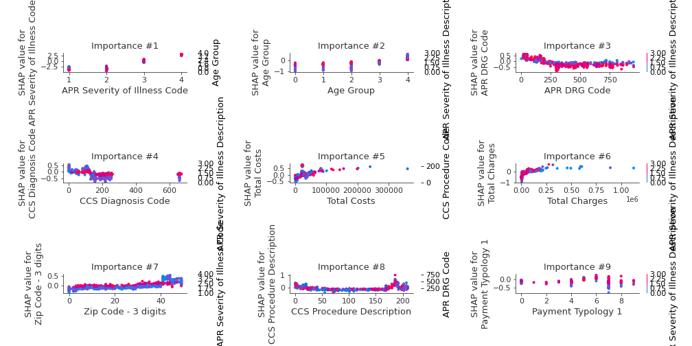
### Dependence Major (Fold 1)
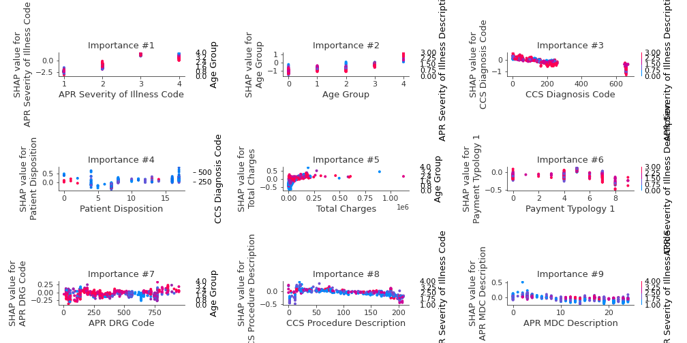
### Dependence Minor (Fold 1)
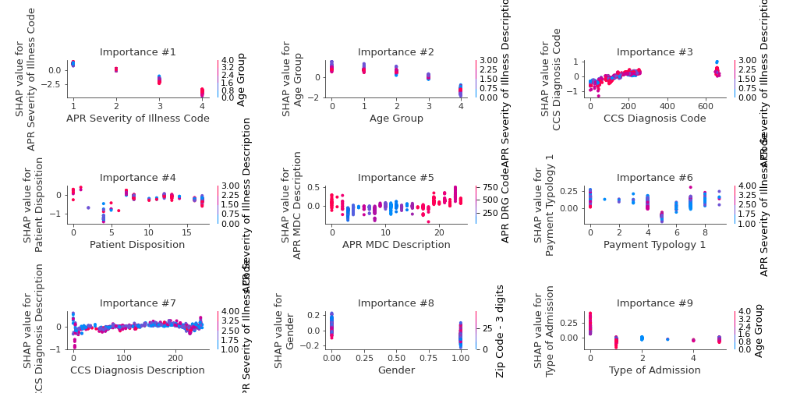
### Dependence Moderate (Fold 1)
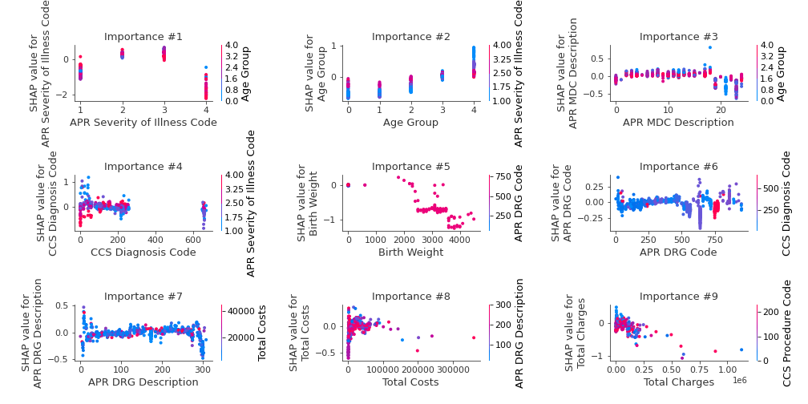

## SHAP Decision plots

### Worst decisions for selected sample 1 (Fold 1)
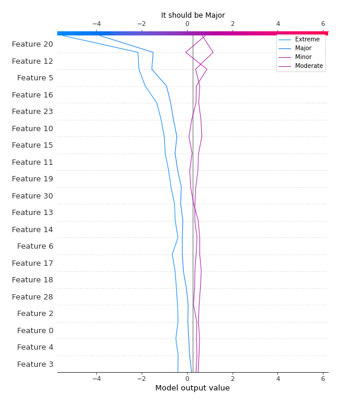
### Worst decisions for selected sample 2 (Fold 1)
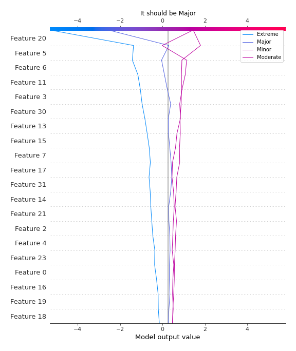
### Worst decisions for selected sample 3 (Fold 1)
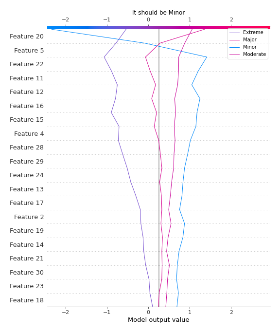
### Worst decisions for selected sample 4 (Fold 1)
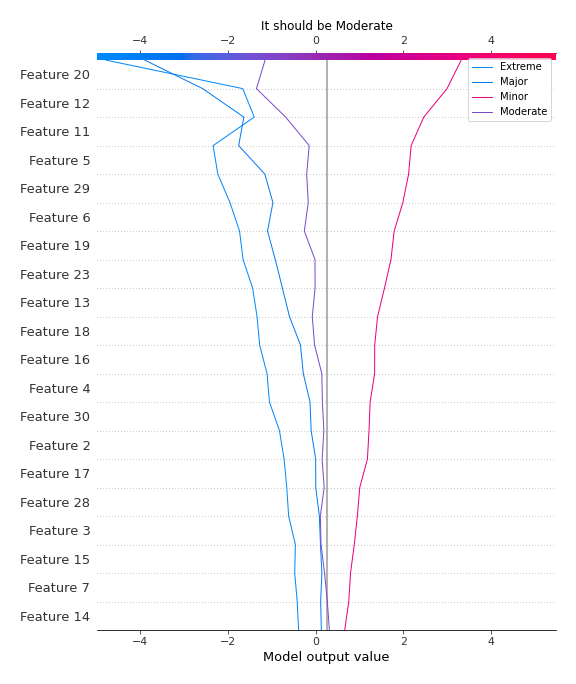
### Best decisions for selected sample 1 (Fold 1)

### Best decisions for selected sample 2 (Fold 1)
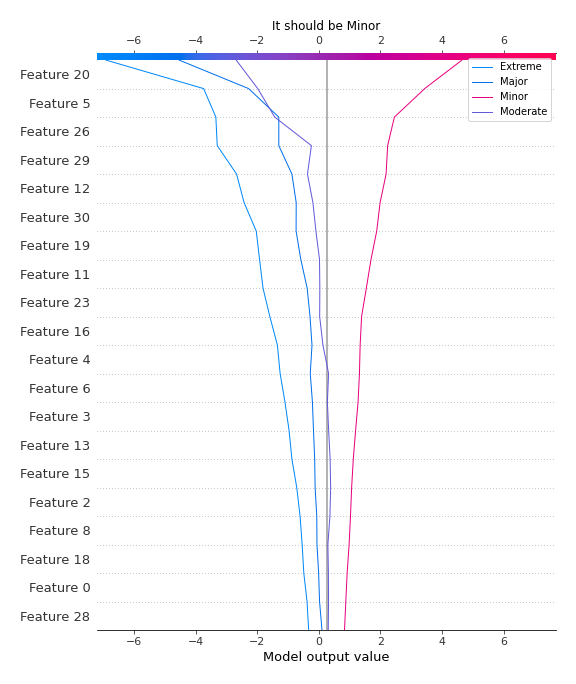
### Best decisions for selected sample 3 (Fold 1)
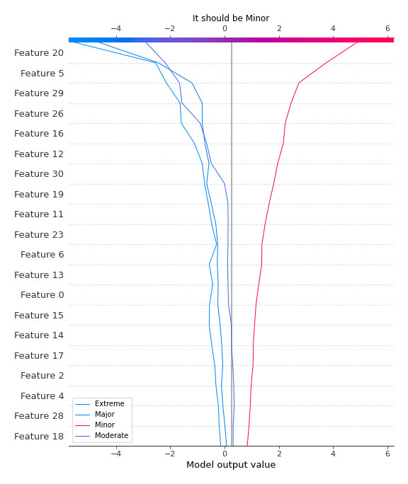
### Best decisions for selected sample 4 (Fold 1)
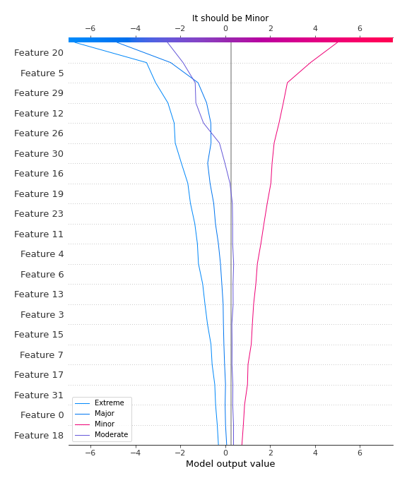

[<< Go back](../README.md)
