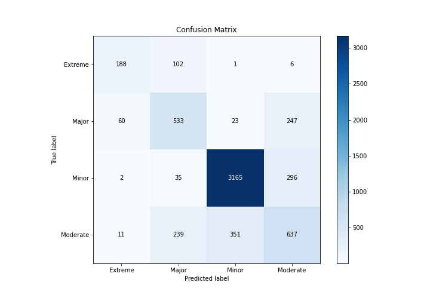

# Summary of 4_Default_NeuralNetwork

[<< Go back](../README.md)

## Neural Network
- **n_jobs**: -1
- **dense_1_size**: 32
- **dense_2_size**: 16
- **learning_rate**: 0.05
- **num_class**: 4
- **explain_level**: 2

## Validation
 - **validation_type**: split
 - **train_ratio**: 0.75
 - **shuffle**: True
 - **stratify**: True

## Optimized metric
logloss

## Training time

12.0 seconds

### Metric details
|           |    Extreme |      Major |       Minor |    Moderate |   accuracy |   macro avg |   weighted avg |   logloss |
|:----------|-----------:|-----------:|------------:|------------:|-----------:|------------:|---------------:|----------:|
| precision |   0.720307 |   0.586359 |    0.894068 |    0.537099 |    0.76713 |    0.684458 |       0.765322 |  0.550027 |
| recall    |   0.632997 |   0.617613 |    0.904803 |    0.51454  |    0.76713 |    0.667488 |       0.76713  |  0.550027 |
| f1-score  |   0.673835 |   0.60158  |    0.899403 |    0.525578 |    0.76713 |    0.675099 |       0.765955 |  0.550027 |
| support   | 297        | 863        | 3498        | 1238        |    0.76713 | 5896        |    5896        |  0.550027 |

## Confusion matrix
|                     |   Predicted as Extreme |   Predicted as Major |   Predicted as Minor |   Predicted as Moderate |
|:--------------------|-----------------------:|---------------------:|---------------------:|------------------------:|
| Labeled as Extreme  |                    188 |                  102 |                    1 |                       6 |
| Labeled as Major    |                     60 |                  533 |                   23 |                     247 |
| Labeled as Minor    |                      2 |                   35 |                 3165 |                     296 |
| Labeled as Moderate |                     11 |                  239 |                  351 |                     637 |

## Learning curves

## Permutation-based Importance

## Confusion Matrix

## Normalized Confusion Matrix

## ROC Curve

## Precision Recall Curve

[<< Go back](../README.md)
