# Summary of 5_Default_RandomForest

[<< Go back](../README.md)

## Random Forest
- **n_jobs**: -1
- **criterion**: gini
- **max_features**: 0.9
- **min_samples_split**: 30
- **max_depth**: 4
- **eval_metric_name**: logloss
- **num_class**: 4
- **explain_level**: 2

## Validation
 - **validation_type**: split
 - **train_ratio**: 0.75
 - **shuffle**: True
 - **stratify**: True

## Optimized metric
logloss

## Training time

30.9 seconds

### Metric details
|           |    Extreme |      Major |       Minor |    Moderate |   accuracy |   macro avg |   weighted avg |   logloss |
|:----------|-----------:|-----------:|------------:|------------:|-----------:|------------:|---------------:|----------:|
| precision |   0.644258 |   0.673267 |    0.874562 |    0.534258 |   0.769166 |    0.681586 |       0.762042 |  0.547167 |
| recall    |   0.774411 |   0.472769 |    0.926815 |    0.529079 |   0.769166 |    0.675769 |       0.769166 |  0.547167 |
| f1-score  |   0.703364 |   0.55548  |    0.899931 |    0.531656 |   0.769166 |    0.672608 |       0.762284 |  0.547167 |
| support   | 297        | 863        | 3498        | 1238        |   0.769166 | 5896        |    5896        |  0.547167 |

## Confusion matrix
|                     |   Predicted as Extreme |   Predicted as Major |   Predicted as Minor |   Predicted as Moderate |
|:--------------------|-----------------------:|---------------------:|---------------------:|------------------------:|
| Labeled as Extreme  |                    230 |                   51 |                    2 |                      14 |
| Labeled as Major    |                    105 |                  408 |                   39 |                     311 |
| Labeled as Minor    |                      5 |                    5 |                 3242 |                     246 |
| Labeled as Moderate |                     17 |                  142 |                  424 |                     655 |

## Learning curves
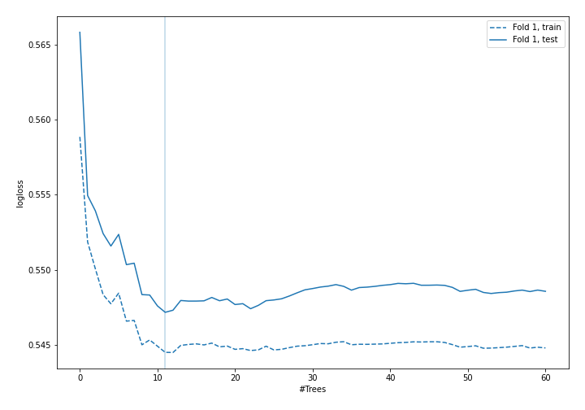

## Permutation-based Importance
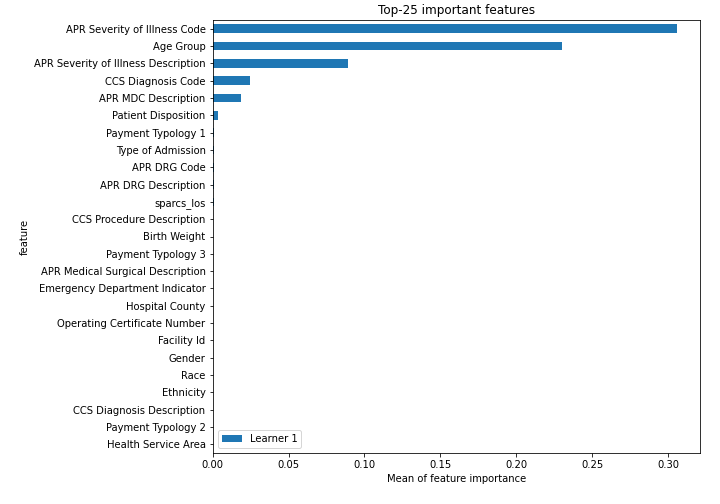
## Confusion Matrix

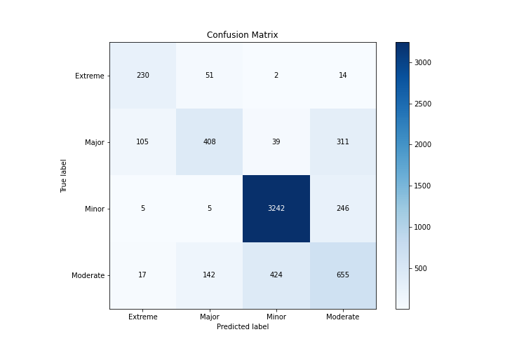

## Normalized Confusion Matrix

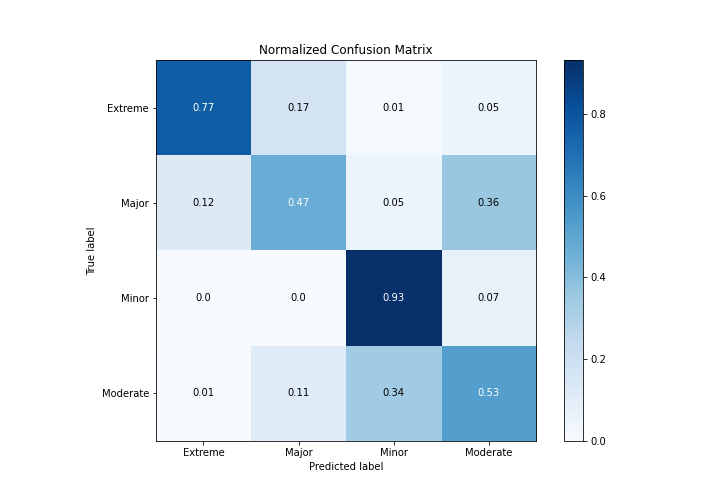

## ROC Curve

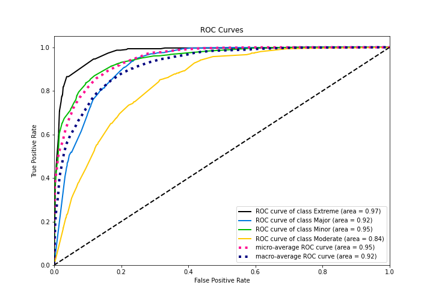

## Precision Recall Curve

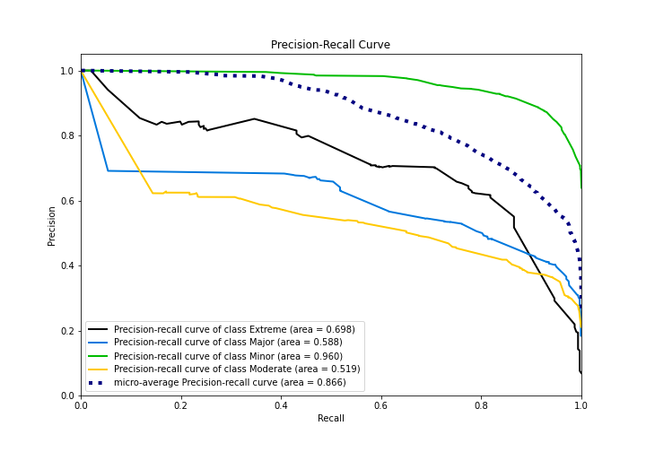

## SHAP Importance
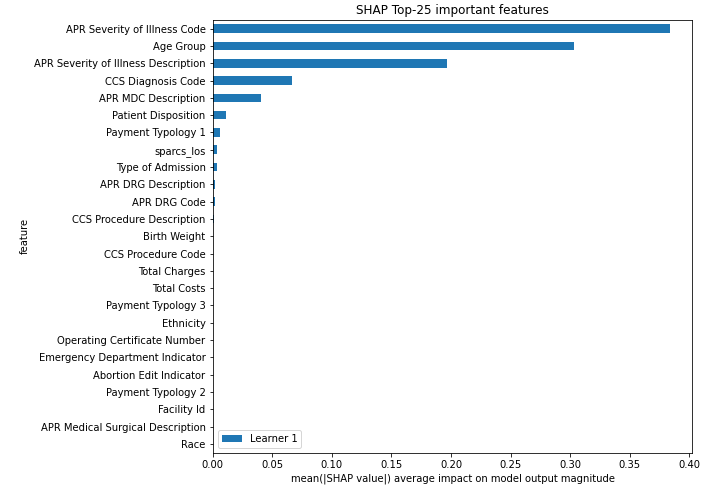

## SHAP Dependence plots

### Dependence Extreme (Fold 1)
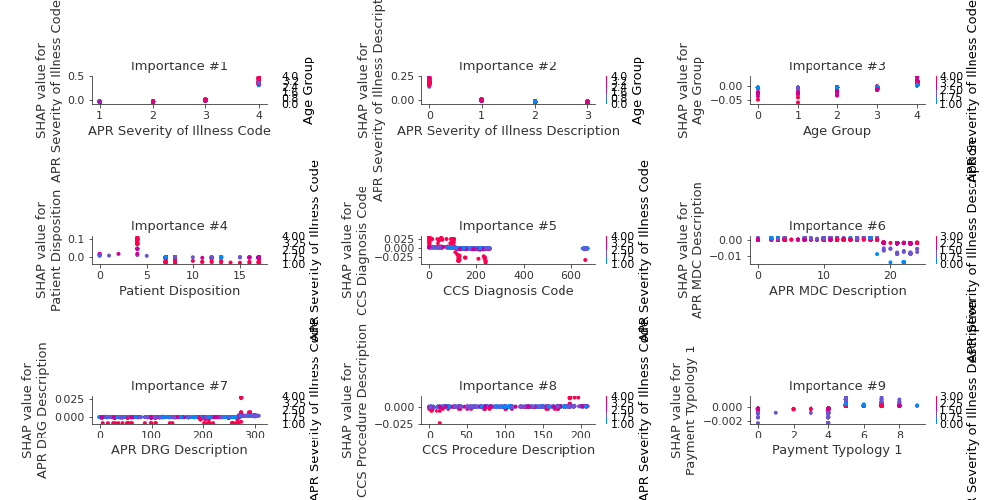
### Dependence Major (Fold 1)
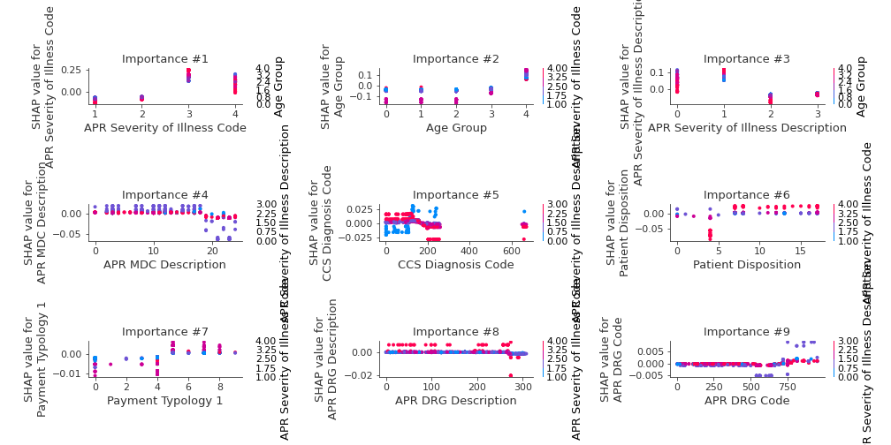
### Dependence Minor (Fold 1)
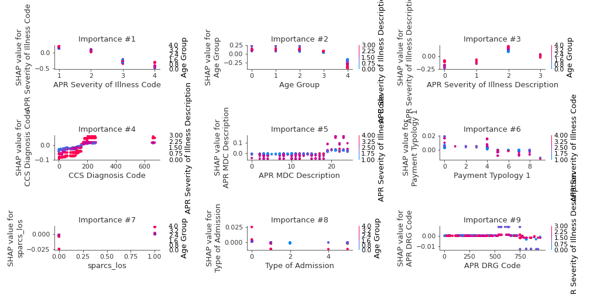
### Dependence Moderate (Fold 1)
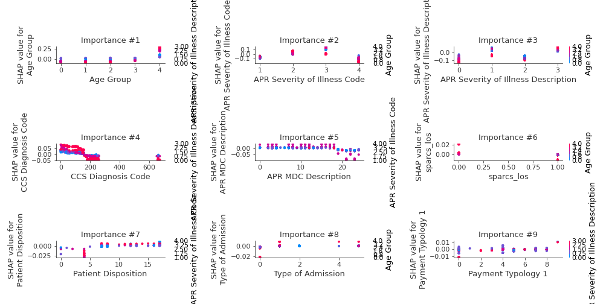

## SHAP Decision plots

### Worst decisions for selected sample 1 (Fold 1)

### Worst decisions for selected sample 2 (Fold 1)
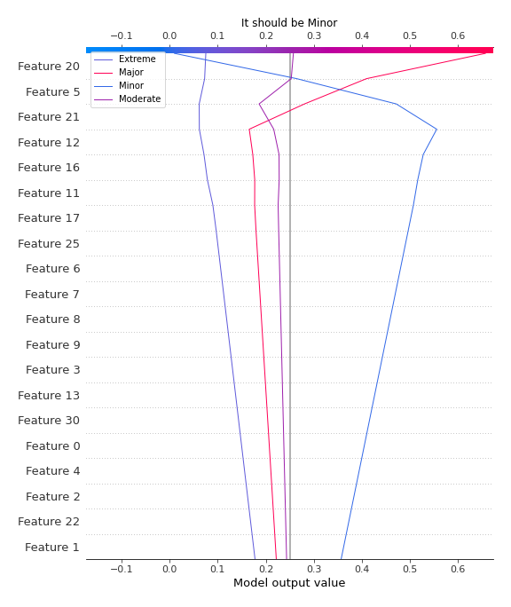
### Worst decisions for selected sample 3 (Fold 1)
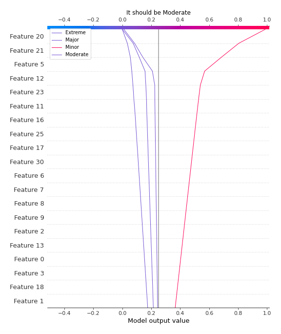
### Worst decisions for selected sample 4 (Fold 1)

### Best decisions for selected sample 1 (Fold 1)

### Best decisions for selected sample 2 (Fold 1)
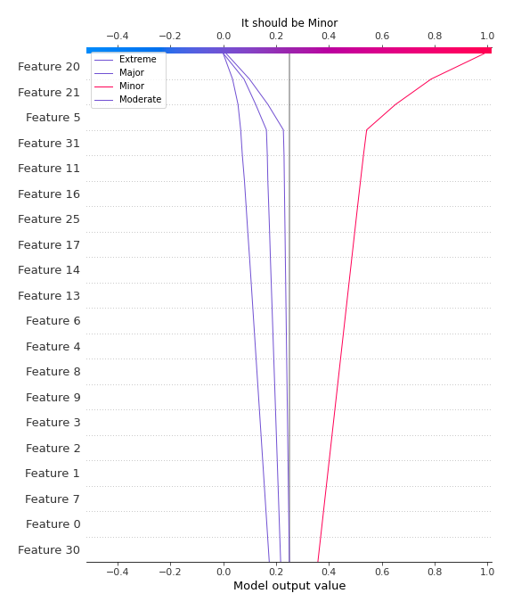
### Best decisions for selected sample 3 (Fold 1)

### Best decisions for selected sample 4 (Fold 1)
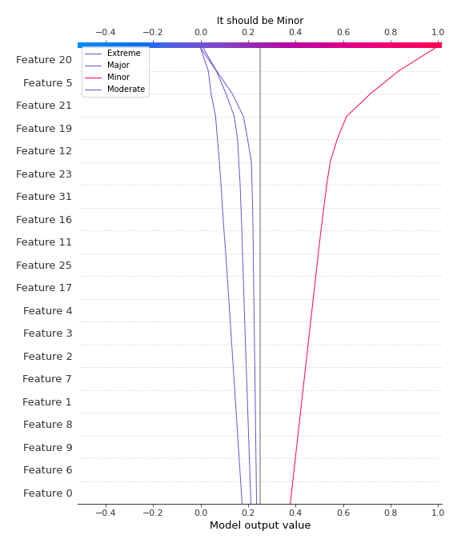

[<< Go back](../README.md)
