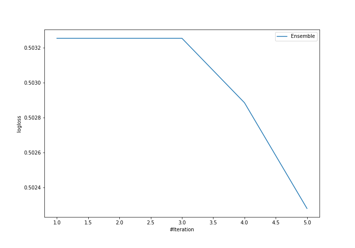
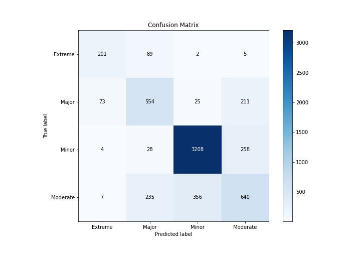
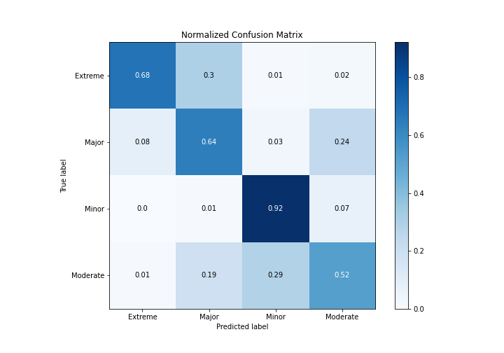
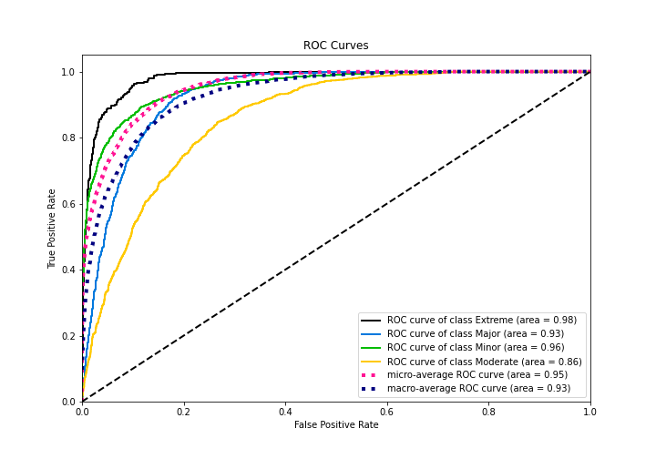
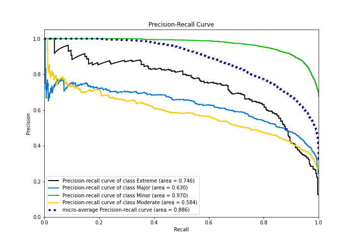

# Summary of Ensemble

[<< Go back](../README.md)

## Ensemble structure
| Model                   |   Weight |
|:------------------------|---------:|
| 3_Default_Xgboost       |        4 |
| 4_Default_NeuralNetwork |        1 |

### Metric details
|           |    Extreme |      Major |       Minor |    Moderate |   accuracy |   macro avg |   weighted avg |   logloss |
|:----------|-----------:|-----------:|------------:|------------:|-----------:|------------:|---------------:|----------:|
| precision |   0.705263 |   0.611479 |    0.893344 |    0.574506 |   0.780699 |    0.696148 |       0.775666 |  0.502281 |
| recall    |   0.676768 |   0.641947 |    0.917095 |    0.516963 |   0.780699 |    0.688193 |       0.780699 |  0.502281 |
| f1-score  |   0.690722 |   0.626343 |    0.905064 |    0.544218 |   0.780699 |    0.691587 |       0.777703 |  0.502281 |
| support   | 297        | 863        | 3498        | 1238        |   0.780699 | 5896        |    5896        |  0.502281 |

## Confusion matrix
|                     |   Predicted as Extreme |   Predicted as Major |   Predicted as Minor |   Predicted as Moderate |
|:--------------------|-----------------------:|---------------------:|---------------------:|------------------------:|
| Labeled as Extreme  |                    201 |                   89 |                    2 |                       5 |
| Labeled as Major    |                     73 |                  554 |                   25 |                     211 |
| Labeled as Minor    |                      4 |                   28 |                 3208 |                     258 |
| Labeled as Moderate |                      7 |                  235 |                  356 |                     640 |

## Learning curves

## Confusion Matrix

## Normalized Confusion Matrix

## ROC Curve

## Precision Recall Curve

[<< Go back](../README.md)
