# Summary of 2_DecisionTree

[<< Go back](../README.md)

## Decision Tree
- **n_jobs**: -1
- **criterion**: gini
- **max_depth**: 3
- **explain_level**: 2

## Validation
 - **validation_type**: split
 - **train_ratio**: 0.75
 - **shuffle**: True
 - **stratify**: True

## Optimized metric
logloss

## Training time

16.6 seconds

## Metric details
|           |    score |   threshold |
|:----------|---------:|------------:|
| logloss   | 0.454124 | nan         |
| auc       | 0.858947 | nan         |
| f1        | 0.825033 |   0.310846  |
| accuracy  | 0.792628 |   0.310846  |
| precision | 0.94211  |   0.841315  |
| recall    | 1        |   0.0420701 |
| mcc       | 0.581852 |   0.310846  |

## Metric details with threshold from accuracy metric
|           |    score |   threshold |
|:----------|---------:|------------:|
| logloss   | 0.454124 |  nan        |
| auc       | 0.858947 |  nan        |
| f1        | 0.825033 |    0.310846 |
| accuracy  | 0.792628 |    0.310846 |
| precision | 0.771592 |    0.310846 |
| recall    | 0.886429 |    0.310846 |
| mcc       | 0.581852 |    0.310846 |

## Confusion matrix (at threshold=0.310846)
|                  |   Predicted as long |   Predicted as short |
|:-----------------|--------------------:|---------------------:|
| Labeled as long  |                1343 |                  640 |
| Labeled as short |                 277 |                 2162 |

## Learning curves
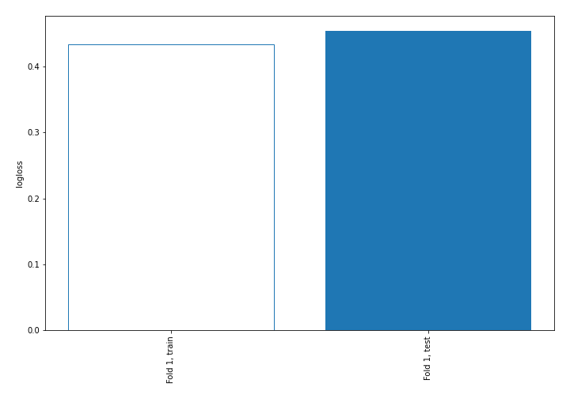

## Decision Tree 

### Tree #1
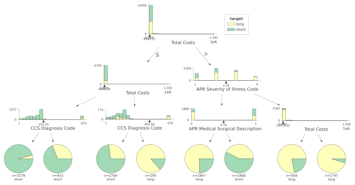

### Rules

if (Total Costs <= 8584.205) and (Total Costs <= 4865.995) and (CCS Diagnosis Code <= 253.5) then class: short (proba: 95.64%) | based on 3,278 samples

if (Total Costs <= 8584.205) and (Total Costs > 4865.995) and (CCS Diagnosis Code <= 454.5) then class: short (proba: 72.63%) | based on 2,769 samples

if (Total Costs > 8584.205) and (APR Severity of Illness Code <= 2.5) and (APR Medical Surgical Description > 0.5) then class: short (proba: 57.49%) | based on 1,868 samples

if (Total Costs > 8584.205) and (APR Severity of Illness Code <= 2.5) and (APR Medical Surgical Description <= 0.5) then class: long (proba: 75.53%) | based on 1,847 samples

if (Total Costs > 8584.205) and (APR Severity of Illness Code > 2.5) and (Total Costs > 15573.525) then class: long (proba: 95.33%) | based on 1,797 samples

if (Total Costs > 8584.205) and (APR Severity of Illness Code > 2.5) and (Total Costs <= 15573.525) then class: long (proba: 78.08%) | based on 958 samples

if (Total Costs <= 8584.205) and (Total Costs <= 4865.995) and (CCS Diagnosis Code > 253.5) then class: short (proba: 68.65%) | based on 453 samples

if (Total Costs <= 8584.205) and (Total Costs > 4865.995) and (CCS Diagnosis Code > 454.5) then class: long (proba: 86.44%) | based on 295 samples

## Permutation-based Importance
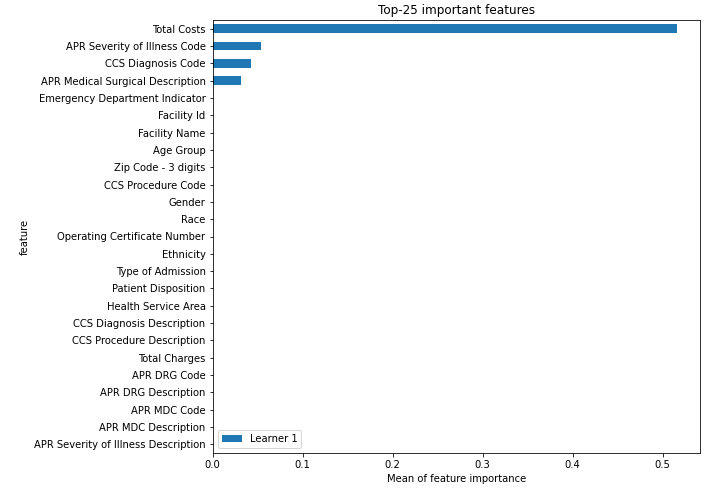
## Confusion Matrix

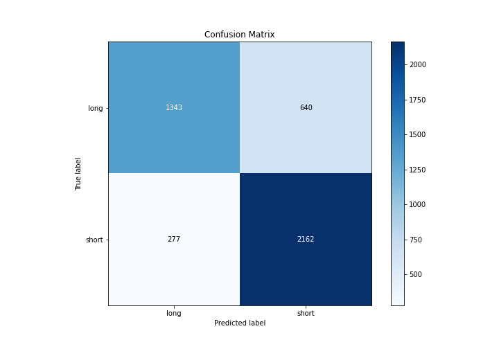

## Normalized Confusion Matrix

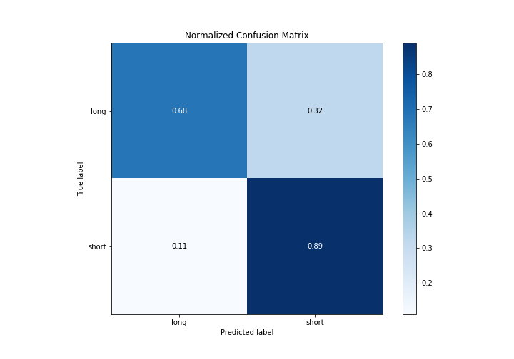

## ROC Curve

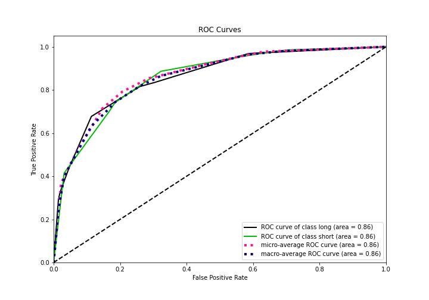

## Kolmogorov-Smirnov Statistic

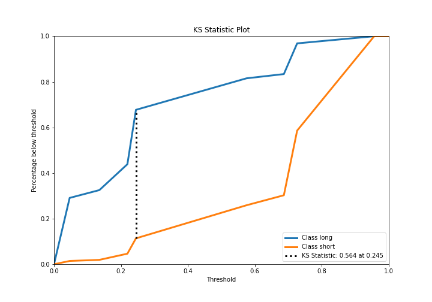

## Precision-Recall Curve

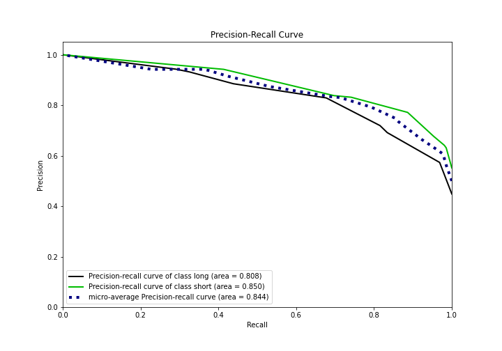

## Calibration Curve

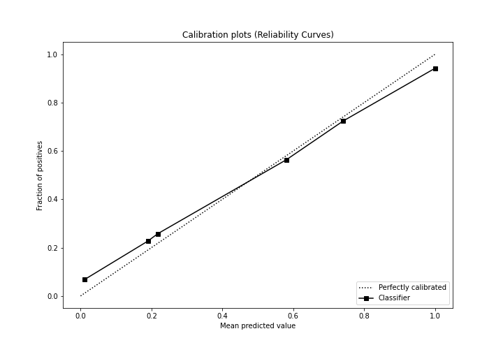

## Cumulative Gains Curve

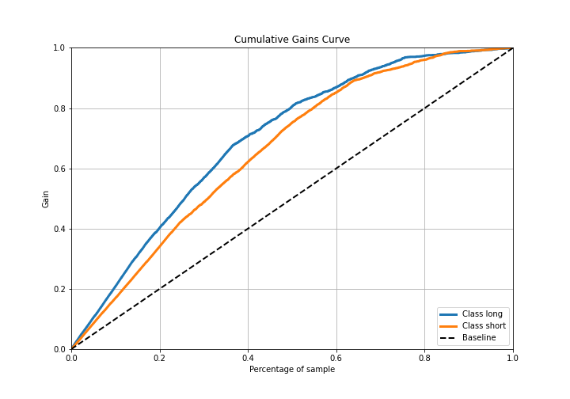

## Lift Curve

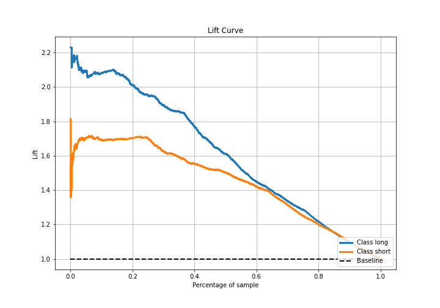

## SHAP Importance
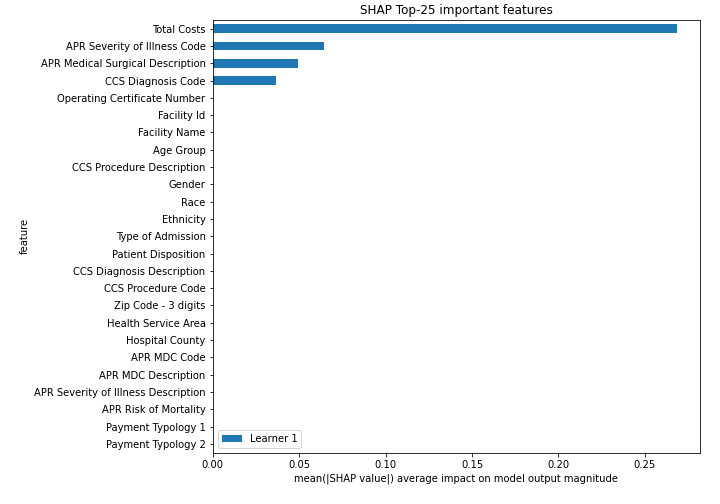

## SHAP Dependence plots

### Dependence (Fold 1)
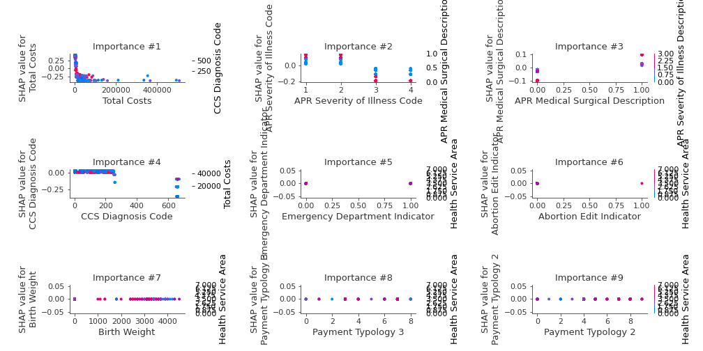

## SHAP Decision plots

### Top-10 Worst decisions for class 0 (Fold 1)
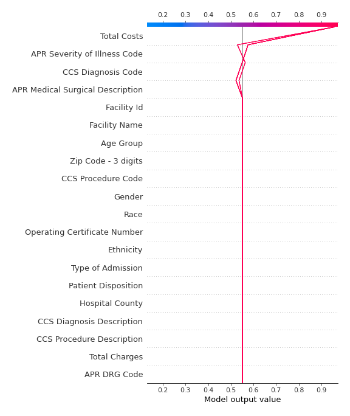
### Top-10 Best decisions for class 0 (Fold 1)

### Top-10 Worst decisions for class 1 (Fold 1)
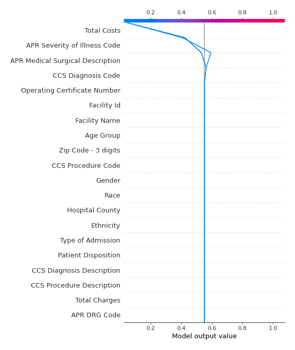
### Top-10 Best decisions for class 1 (Fold 1)
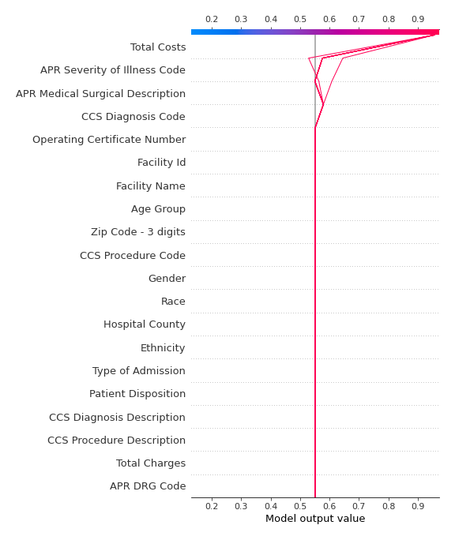

[<< Go back](../README.md)
