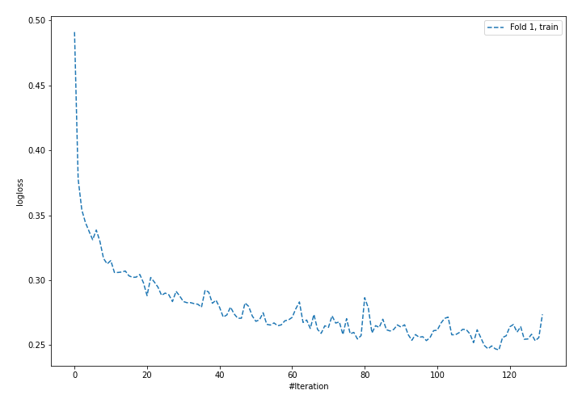

# Summary of 4_Default_NeuralNetwork

[<< Go back](../README.md)

## Neural Network
- **n_jobs**: -1
- **dense_1_size**: 32
- **dense_2_size**: 16
- **learning_rate**: 0.05
- **explain_level**: 2

## Validation
 - **validation_type**: split
 - **train_ratio**: 0.75
 - **shuffle**: True
 - **stratify**: True

## Optimized metric
logloss

## Training time

14.0 seconds

## Metric details
|           |    score |     threshold |
|:----------|---------:|--------------:|
| logloss   | 0.485527 | nan           |
| auc       | 0.912011 | nan           |
| f1        | 0.857029 |   0.272604    |
| accuracy  | 0.839665 |   0.369153    |
| precision | 0.960199 |   0.975159    |
| recall    | 1        |   3.31565e-48 |
| mcc       | 0.676713 |   0.369153    |

## Metric details with threshold from accuracy metric
|           |    score |   threshold |
|:----------|---------:|------------:|
| logloss   | 0.485527 |  nan        |
| auc       | 0.912011 |  nan        |
| f1        | 0.8533   |    0.369153 |
| accuracy  | 0.839665 |    0.369153 |
| precision | 0.86132  |    0.369153 |
| recall    | 0.845428 |    0.369153 |
| mcc       | 0.676713 |    0.369153 |

## Confusion matrix (at threshold=0.369153)
|                  |   Predicted as long |   Predicted as short |
|:-----------------|--------------------:|---------------------:|
| Labeled as long  |                1651 |                  332 |
| Labeled as short |                 377 |                 2062 |

## Learning curves

## Permutation-based Importance

## Confusion Matrix

## Normalized Confusion Matrix

## ROC Curve

## Kolmogorov-Smirnov Statistic

## Precision-Recall Curve

## Calibration Curve

## Cumulative Gains Curve

## Lift Curve

[<< Go back](../README.md)
