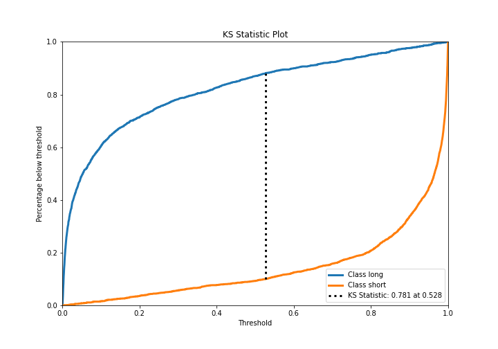

# Summary of Ensemble

[<< Go back](../README.md)

## Ensemble structure
| Model             |   Weight |
|:------------------|---------:|
| 3_Default_Xgboost |        5 |

## Metric details
|           |    score |     threshold |
|:----------|---------:|--------------:|
| logloss   | 0.267911 | nan           |
| auc       | 0.95594  | nan           |
| f1        | 0.901609 |   0.500049    |
| accuracy  | 0.891226 |   0.520298    |
| precision | 0.997674 |   0.995696    |
| recall    | 1        |   0.000343896 |
| mcc       | 0.780103 |   0.520298    |

## Metric details with threshold from accuracy metric
|           |    score |   threshold |
|:----------|---------:|------------:|
| logloss   | 0.267911 |  nan        |
| auc       | 0.95594  |  nan        |
| f1        | 0.901414 |    0.520298 |
| accuracy  | 0.891226 |    0.520298 |
| precision | 0.90123  |    0.520298 |
| recall    | 0.901599 |    0.520298 |
| mcc       | 0.780103 |    0.520298 |

## Confusion matrix (at threshold=0.520298)
|                  |   Predicted as long |   Predicted as short |
|:-----------------|--------------------:|---------------------:|
| Labeled as long  |                1742 |                  241 |
| Labeled as short |                 240 |                 2199 |

## Learning curves

## Confusion Matrix

## Normalized Confusion Matrix

## ROC Curve

## Kolmogorov-Smirnov Statistic

## Precision-Recall Curve

## Calibration Curve

## Cumulative Gains Curve

## Lift Curve

[<< Go back](../README.md)
